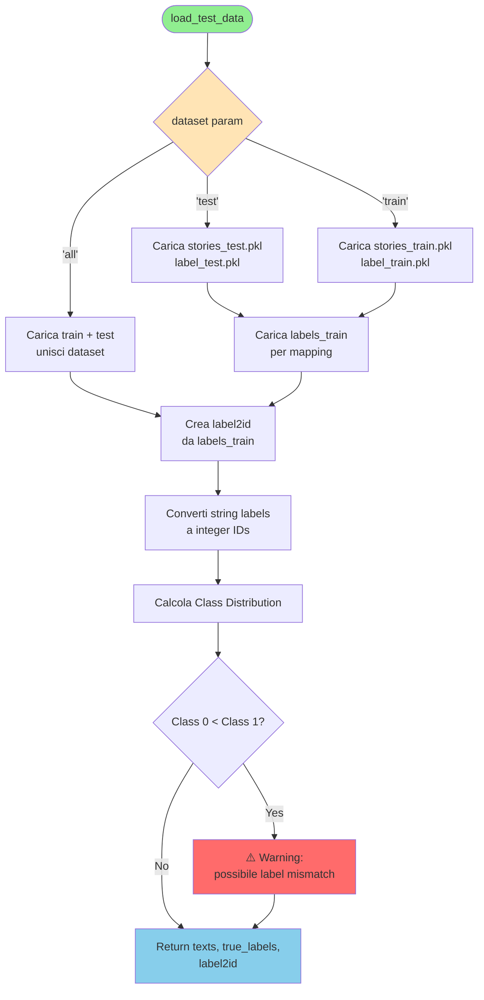
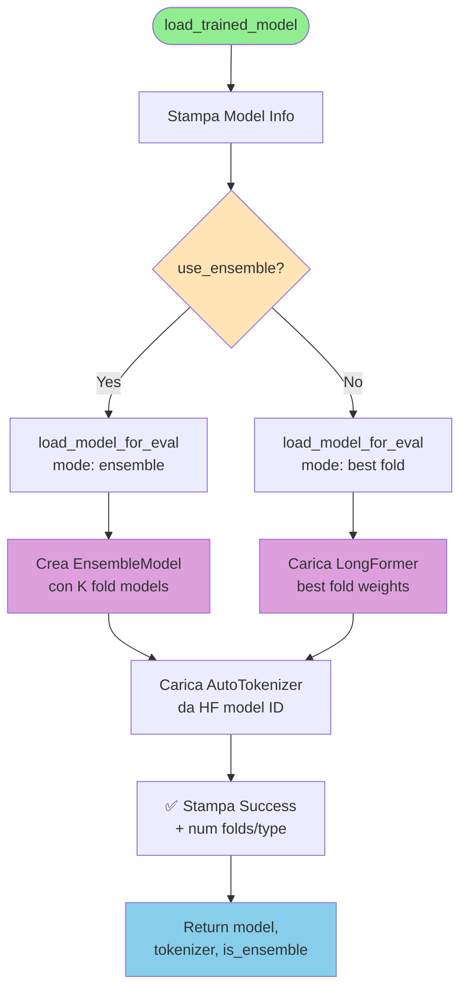
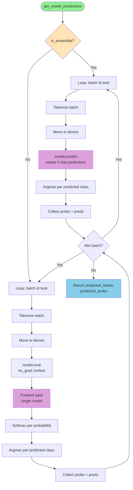
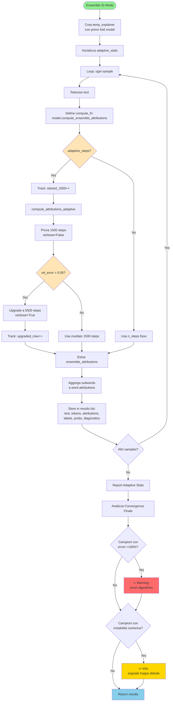
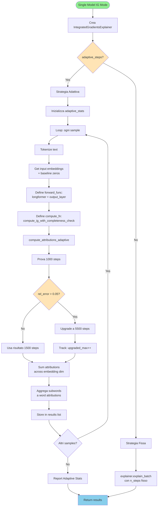
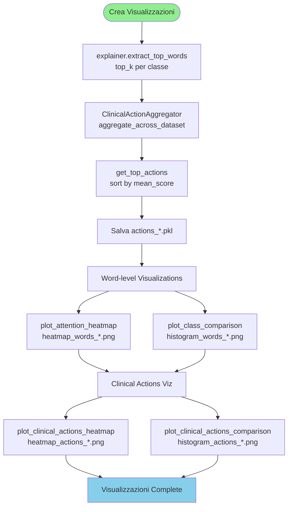
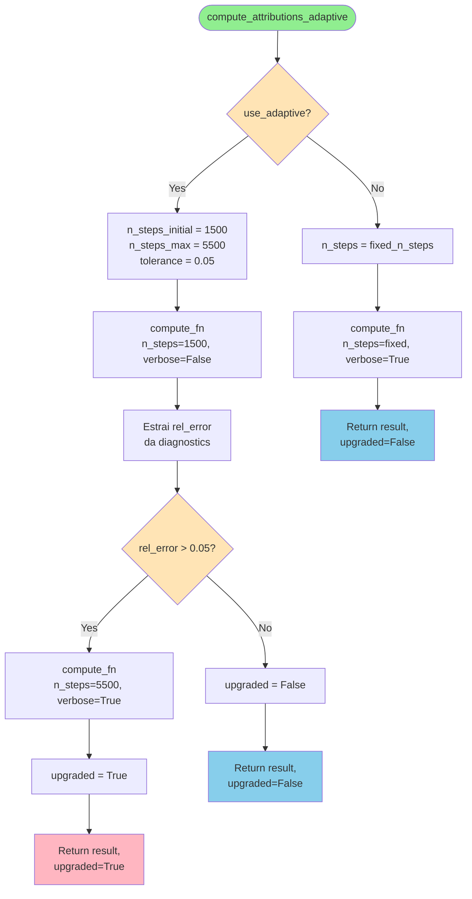

# Extract Explainability - Diagramma di Flusso

## Panoramica
Script per l'estrazione degli attribution scores usando Integrated Gradients e generazione di visualizzazioni per l'interpretabilità dei modelli.

---

## 🔄 Flusso Principale

```mermaid
flowchart TD
    Start([Avvio Script]) --> ParseArgs[Parse Argomenti CLI]
    ParseArgs --> PrintConfig[Stampa Configurazione]
    
    PrintConfig --> EnsureDir[Crea Directory Output]
    EnsureDir --> LoadData[Load Test/Train Data]
    
    LoadData --> GetNumClasses{Determina num_classes}
    GetNumClasses --> LoadModel[Load Trained Model]
    
    LoadModel --> CheckEnsemble{use_ensemble?}
    CheckEnsemble -->|Yes| LoadEnsemble[Carica EnsembleModel<br/>tutti i fold]
    CheckEnsemble -->|No| LoadSingle[Carica Best Fold<br/>modello singolo]
    
    LoadEnsemble --> LoadTokenizer[Carica Tokenizer]
    LoadSingle --> LoadTokenizer
    
    LoadTokenizer --> LimitSamples{n_samples<br/>specificato?}
    LimitSamples -->|Yes| TruncateData[Tronca Dataset]
    LimitSamples -->|No| KeepAll[Usa Tutto il Dataset]
    
    TruncateData --> GetPredictions[Genera Predizioni]
    KeepAll --> GetPredictions
    
    GetPredictions --> CalcStats[Calcola Accuracy e<br/>Distribuzione Classi]
    
    CalcStats --> ExtractIG[Estrai Integrated Gradients]
    
    ExtractIG --> CheckMode{is_ensemble?}
    
    CheckMode -->|Yes| EnsembleIG[Ensemble IG Mode]
    CheckMode -->|No| SingleIG[Single Model IG Mode]
    
    EnsembleIG --> SaveResults[Salva Risultati Raw<br/>ig_results_*.pkl]
    SingleIG --> SaveResults
    
    SaveResults --> ExtractTopWords[Estrai Top-K Words<br/>per Classe]
    
    ExtractTopWords --> AggregateActions[Aggrega Clinical Actions<br/>per Classe]
    
    AggregateActions --> SaveActions[Salva Action Results<br/>actions_*.pkl]
    
    SaveActions --> CreateViz[Crea Visualizzazioni]
    
    CreateViz --> WordViz[Word-level Plots<br/>Heatmap + Histogram]
    CreateViz --> ActionViz[Clinical Actions Plots<br/>Heatmap + Histogram]
    
    WordViz --> PrintSummary[Stampa Summary<br/>File Output]
    ActionViz --> PrintSummary
    
    PrintSummary --> End([Fine])
    
    style Start fill:#90EE90
    style End fill:#FFB6C1
    style CheckEnsemble fill:#FFE4B5
    style CheckMode fill:#FFE4B5
    style LimitSamples fill:#FFE4B5
    style ExtractIG fill:#87CEEB
    style EnsembleIG fill:#DDA0DD
    style SingleIG fill:#DDA0DD
```



---

## 📊 Flusso Dettagliato: Load Data



---

## 🤖 Flusso Dettagliato: Load Model



---

## 🔮 Flusso Dettagliato: Get Predictions



---

## 🔍 Flusso Dettagliato: Ensemble IG Extraction



---

## 🎯 Flusso Dettagliato: Single Model IG Extraction



---

## 📈 Flusso Dettagliato: Visualizations



---

## 🔧 Helper Function: Adaptive Strategy



---

## 📝 Argomenti CLI Supportati

| Argomento | Default | Descrizione |
|-----------|---------|-------------|
| `--model` | `bert-base-uncased` | Nome modello HuggingFace |
| `--format` | `narrativo` | Formato storie (`narrativo`/`bullet`/`clinical`) |
| `--dataset` | `test` | Dataset da analizzare (`test`/`train`/`all`) |
| `--n_samples` | `None` | Limita numero samples (None = tutti) |
| `--top_k` | `20` | Top-K words/actions per visualizzazioni |
| `--device` | `cuda` (auto) | Device per computation |
| `--internal_batch_size` | `32` | Batch size per IG interpolation |
| `--n_steps` | `1500` | Steps per IG (modalità fissa) |
| `--adaptive_steps` | `False` | Abilita strategia adattiva (1500→5500) |
| `--use_ensemble` | `False` | Usa K-Fold ensemble invece di best fold |

---

## 🎯 Output Files Generati

### 1. Raw Results
- **File**: `ig_results_{format}_{model}_{mode}_{timestamp}.pkl`
- **Contenuto**: Lista di dizionari con:
  - `text`: Testo originale
  - `tokens`: Token list
  - `token_attributions`: Attribution scores per token
  - `word_attributions`: Attribution aggregati per parola
  - `true_label`, `predicted_label`, `predicted_prob`
  - `diagnostics` (solo ensemble): info convergenza per fold

### 2. Clinical Actions
- **File**: `actions_{format}_{model}_{mode}_{timestamp}.pkl`
- **Contenuto**: Dizionari con aggregazioni:
  - `class_0`: {action_text: {mean_score, count, total_score}}
  - `class_1`: {action_text: {mean_score, count, total_score}}

### 3. Visualizzazioni Word-level
- `heatmap_words_{format}_{model}_{mode}_{timestamp}.png`
- `histogram_words_{format}_{model}_{mode}_{timestamp}.png`

### 4. Visualizzazioni Clinical Actions
- `heatmap_actions_{format}_{model}_{mode}_{timestamp}.png` ⭐
- `histogram_actions_{format}_{model}_{mode}_{timestamp}.png` ⭐

*(⭐ = principali per interpretabilità clinica)*

---

## 💡 Note Implementative

### Strategia Adattiva
1. **Obiettivo**: Risparmiare tempo di computazione (~40-70% a seconda del dataset)
2. **Meccanismo**:
   - Inizia con 1500 steps (silenzioso)
   - Se `rel_error > 0.05` → ricalcola con 5500 steps (verbose)
   - Altrimenti usa risultato 1500 steps
3. **Trade-off**: Overhead 1500 steps vs risparmio su campioni convergenti
4. **Costanti configurabili** (in `extract_explainability.py`):
   - `ADAPTIVE_IG_STEPS_INITIAL = 1500`
   - `ADAPTIVE_IG_STEPS_MAX = 5500`
   - `ADAPTIVE_IG_TOLERANCE = 0.05`

### Ensemble vs Single
- **Ensemble**: Media attributions su K fold models (più robusto)
- **Single**: Usa solo best fold (più veloce)
- **Diagnostics**: Solo ensemble traccia convergenza per-fold

### Gestione Errori
- **Instabilità Numerica** (`f(x)≈f(baseline)`): Segnale troppo debole, IG non affidabile
- **Errori Algoritmici** (`rel_error > 100%`): Non-convergenza vera, serve più steps

---

## 🚀 Esempi d'Uso

```bash
# Single model, dataset test, strategia fissa
python src/explainability/extract_explainability.py \
  --model bert-base-uncased \
  --format narrativo \
  --n_steps 1500

# Ensemble, dataset completo, strategia adattiva (1500→5500)
python src/explainability/extract_explainability.py \
  --model clinical-bert \
  --format narrativo \
  --dataset all \
  --use_ensemble \
  --adaptive_steps

# Analisi rapida su 50 samples
python src/explainability/extract_explainability.py \
  --model pubmedbert-base \
  --format bullet \
  --n_samples 50 \
  --top_k 10
```

---

## 📚 Dipendenze Chiave

| Modulo | Funzione Principale |
|--------|---------------------|
| `IntegratedGradientsExplainer` | Calcolo IG per single model |
| `EnsembleModel.compute_ensemble_attributions` | Calcolo IG per ensemble |
| `ClinicalActionAggregator` | Estrazione azioni cliniche da testo |
| `compute_ig_with_completeness_check` | IG con diagnostics convergenza |
| `load_model_for_eval` | Caricamento modelli (single/ensemble) |
| Visualization functions | Heatmaps e histograms comparativi |

---

*Generato automaticamente da analisi del codice sorgente*
