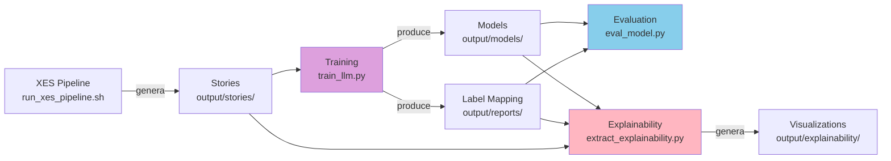

# LEGOLAS - Diagrammi di Flusso

Questa cartella contiene i diagrammi di flusso dettagliati per i componenti principali del sistema LEGOLAS.

---

## 📊 Diagrammi Disponibili

### 1. [Training LLM](TRAIN_LLM_FLOWCHART.md)
**File**: `train_llm.py`  
**Funzione**: Training di modelli LLM su storie cliniche XES

**Modalità supportate**:
- ✅ Training Semplice (train/val split)
- ✅ K-Fold Cross Validation
- ✅ Focal Loss per classi sbilanciate
- ✅ Cross Entropy con class weights automatici

**Diagrammi inclusi**:
- Flusso principale end-to-end
- Parse arguments e configurazione
- K-Fold Cross Validation mode
- Simple training mode
- Training loop dettagliato (pre_train)
- Decision tree per scegliere modalità
- Integrazione con altri componenti

**Quando consultare**:
- Prima di lanciare un training
- Per capire differenze tra modalità semplice e K-Fold
- Per debuggare problemi di training
- Per scegliere loss function appropriata

---

### 2. [Extract Explainability](EXTRACT_EXPLAINABILITY_FLOWCHART.md)
**File**: `extract_explainability.py`  
**Funzione**: Estrazione attribution scores con Integrated Gradients

**Modalità supportate**:
- ✅ Single Model Explainability
- ✅ Ensemble Model Explainability (K-Fold)
- ✅ Adaptive IG steps strategy (1500→5500)
- ✅ Clinical actions aggregation

**Diagrammi inclusi**:
- Flusso principale end-to-end
- Load data (test/train/all)
- Load model (single/ensemble)
- Get predictions
- Ensemble IG extraction
- Single model IG extraction
- Visualizations pipeline
- Adaptive strategy helper

**Quando consultare**:
- Prima di estrarre explainability
- Per capire strategia adattiva IG
- Per debuggare convergenza IG
- Per comprendere differenze single/ensemble

---

## 🗺️ Relazioni tra Componenti



---

## 📁 Struttura File Output

### Training (train_llm.py)
```
output/
├── models/
│   ├── best_model_{format}_{model}.pth              # Simple training
│   ├── best_model_{format}_{model}_fold*.pth        # K-Fold models
│   └── training_history_{format}_{model}*.json     # Training metrics
└── reports/
    ├── label_mapping.json                            # Label mapping (usato da eval/xai)
    ├── fold_*_{format}_{model}_metrics.json         # K-Fold metrics per fold
    └── kfold_aggregated_{format}_{model}_results.json  # K-Fold aggregated
```

### Explainability (extract_explainability.py)
```
output/
└── explainability/
    ├── ig_results_{format}_{model}_{mode}_{timestamp}.pkl         # Raw IG results
    ├── actions_{format}_{model}_{mode}_{timestamp}.pkl            # Clinical actions
    ├── heatmap_words_{format}_{model}_{mode}_{timestamp}.png     # Word heatmap
    ├── histogram_words_{format}_{model}_{mode}_{timestamp}.png   # Word histogram
    ├── heatmap_actions_{format}_{model}_{mode}_{timestamp}.png   # Actions heatmap ⭐
    └── histogram_actions_{format}_{model}_{mode}_{timestamp}.png # Actions histogram ⭐
```

⭐ = File principali per interpretabilità clinica

---

## 🔧 Script Helper

### Esecuzione Interattiva Training
```bash
# Script interattivo con menu
./scripts/run_train_eval.sh

# Il menu guida attraverso:
# 1. Scelta azione (train/eval/both)
# 2. Scelta formato storie
# 3. Scelta modello
# 4. Modalità training (semplice/K-Fold) 
# 5. Loss function (CE/Focal)
# 6. Hyperparameters
# 7. Evaluation mode (single/ensemble)
```

### Esecuzione Diretta Training
```bash
# Training semplice con CE Loss
uv run python src/training/train_llm.py \
  --model_name bert-base-uncased \
  --story_format narrativo \
  --epochs 10 \
  --batch_size 16

# K-Fold con Focal Loss
uv run python src/training/train_llm.py \
  --model_name clinical-bert \
  --story_format narrativo \
  --use_kfold \
  --n_folds 5 \
  --use_focal_loss \
  --focal_alpha 0.25 0.75
```

### Esecuzione Diretta Explainability
```bash
# Single model con adaptive IG
uv run python src/explainability/extract_explainability.py \
  --model bert-base-uncased \
  --format narrativo \
  --adaptive_steps

# Ensemble con fixed IG
uv run python src/explainability/extract_explainability.py \
  --model clinical-bert \
  --format narrativo \
  --use_ensemble \
  --n_steps 5500
```

---

## 📖 Documentazione Correlata

- **Training Guide**: `docs/TRAIN_LLM_INTEGRATION.md`
- **Explainability Guide**: `docs/EXPLAINABILITY_GUIDE.md`
- **Model Configuration**: `docs/MODEL_CONFIG_GUIDE.md`
- **Path Management**: `src/config/paths.py`
- **Adaptive IG Refactoring**: `docs/ADAPTIVE_IG_REFACTORING.md`

---

## 🆕 Changelog

### 2025-10-22
- ✅ Aggiunto supporto modalità training opzionale (semplice/K-Fold) in `run_train_eval.sh`
- ✅ Creato `TRAIN_LLM_FLOWCHART.md` con diagrammi completi
- ✅ Spostato `EXTRACT_EXPLAINABILITY_FLOWCHART.md` in `docs/flowcharts/`
- ✅ Aggiornato focus visualizzazioni su Classe 1 (target principale)
- ✅ Uniformati valori adaptive IG (1500→5500)
- ✅ Creato questo INDEX per navigazione rapida

---