# Train LLM - Diagramma di Flusso

## Panoramica
Script principale per il training di modelli LLM su storie cliniche XES generate. Supporta sia training semplice che K-Fold Cross Validation con configurazioni avanzate per gestire classi sbilanciate.

---

## 🔄 Flusso Principale

```mermaid
flowchart TD
    Start([Avvio train_llm.py]) --> ParseArgs[Parse CLI Arguments]
    ParseArgs --> CreateConfig[Crea TrainingConfig<br/>da argomenti]
    
    CreateConfig --> SetSeed[Set Random Seed<br/>per riproducibilità]
    
    SetSeed --> PrintConfig[Stampa Configurazione<br/>completa]
    
    PrintConfig --> EnsureDir[Assicura Directory<br/>esistano]
    
    EnsureDir --> LoadStories[Carica Storie XES]
    
    LoadStories --> LoadTrain[Carica train stories<br/>+ labels]
    LoadTrain --> LoadTest[Carica test stories<br/>+ labels]
    
    LoadTest --> CreateMapping[Crea Label Mapping<br/>label2id, id2label]
    
    CreateMapping --> SaveMapping[Salva label_mapping.json<br/>per eval/explainability]
    
    SaveMapping --> ConvertLabels[Converti Labels<br/>string → integer IDs]
    
    ConvertLabels --> TrainValSplit[Train/Val Split<br/>stratified, test_size=0.2]
    
    TrainValSplit --> AnalyzeDist[Analizza e Stampa<br/>Distribuzione Classi]
    
    AnalyzeDist --> LoadModelConfig[Carica Model Config<br/>da YAML o legacy]
    
    LoadModelConfig --> CheckCache{Modello in<br/>cache locale?}
    
    CheckCache -->|Yes| UseCache[Usa cache HF]
    CheckCache -->|No| DownloadHF[Scarica da<br/>HuggingFace]
    
    UseCache --> InitAccelerator[Inizializza Accelerator<br/>per distributed training]
    DownloadHF --> InitAccelerator
    
    InitAccelerator --> CheckModelType{Tipo<br/>modello?}
    
    CheckModelType -->|GPT2| InitGPT2[Crea SimpleGPT2SequenceClassifier]
    CheckModelType -->|BERT-like| InitBERT[Crea LongFormerMultiClassificationHeads]
    
    InitGPT2 --> CreateDatasets[Crea TextDataset<br/>train + val]
    InitBERT --> CreateDatasets
    
    CreateDatasets --> ConfigureLoss[Configura Loss Function]
    
    ConfigureLoss --> CheckLossType{Loss<br/>Function?}
    
    CheckLossType -->|Focal| CreateFocal[Crea FocalLoss<br/>con α e γ da config]
    CheckLossType -->|CrossEntropy| CalcWeights[Calcola Class Weights<br/>automatici balanced]
    
    CreateFocal --> CheckTrainingMode{Training<br/>Mode?}
    CalcWeights --> CheckTrainingMode
    
    CheckTrainingMode -->|K-Fold| KFoldMode[MODALITÀ K-FOLD CV]
    CheckTrainingMode -->|Simple| SimpleMode[MODALITÀ TRAINING SEMPLICE]
    
    KFoldMode --> CombineData[Combina train + val<br/>per K-Fold]
    CombineData --> CreateModelFactory[Crea model_factory<br/>per istanziare modelli freschi]
    CreateModelFactory --> CreateTrainFunc[Crea train_fold_fn<br/>wrapper per pre_train]
    CreateTrainFunc --> InitKFoldTrainer[Inizializza KFoldTrainer]
    InitKFoldTrainer --> RunKFold[Esegui K-Fold Training]
    RunKFold --> KFoldResults[Stampa Risultati<br/>Mean ± Std Metrics]
    KFoldResults --> End([Fine])
    
    SimpleMode --> CreateOptimizer[Crea AdamW Optimizer]
    CreateOptimizer --> CreateScheduler[Crea ReduceLROnPlateau<br/>Scheduler]
    CreateScheduler --> PrepareAccelerator[Prepare con Accelerator<br/>model, optimizer, dataloaders]
    PrepareAccelerator --> CreateCheckpoint[Crea ModelCheckpoint<br/>per salvare best model]
    CreateCheckpoint --> CreateEarlyStopping[Crea EarlyStopping<br/>con patience e loss ratio]
    CreateEarlyStopping --> CallPreTrain[Chiama pre_train<br/>funzione]
    CallPreTrain --> End
    
    style Start fill:#90EE90
    style End fill:#FFB6C1
    style CheckTrainingMode fill:#FFE4B5
    style KFoldMode fill:#DDA0DD
    style SimpleMode fill:#87CEEB
    style CheckLossType fill:#FFE4B5
    style CheckModelType fill:#FFE4B5
```



---

## 📊 Flusso Dettagliato: Parse Arguments & Config


---

## 🔄 Flusso Dettagliato: K-Fold Cross Validation Mode


---

## 🎯 Flusso Dettagliato: Simple Training Mode


---

## 🔥 Flusso Dettagliato: pre_train (Training Loop)


---

## 📝 Argomenti CLI Supportati

| Argomento | Tipo | Default | Descrizione |
|-----------|------|---------|-------------|
| `--model_name` | str | **required** | Nome modello (bertm, cbert, roberta, gpt2, etc.) |
| `--story_format` | str | **required** | Formato storie (narrativo/bullet/clinical) |
| `--use_kfold` | flag | `False` | Abilita K-Fold Cross Validation |
| `--n_folds` | int | `5` | Numero di fold per K-Fold CV |
| `--use_focal_loss` | flag | `False` | Usa Focal Loss invece di Cross Entropy |
| `--focal_alpha` | float[] | `[0.25, 0.75]` | Pesi alpha per Focal Loss |
| `--focal_gamma` | float | `2.0` | Parametro gamma per Focal Loss |
| `--epochs` | int | `50` | Numero massimo di epoch |
| `--batch_size` | int | `16` | Batch size per training e validation |
| `--learning_rate` | float | `5e-5` | Learning rate per optimizer |
| `--patience` | int | `3` | Patience per early stopping |
| `--seed` | int | `42` | Random seed per riproducibilità |

---

## 🎯 Output Files Generati

### Modalità Training Semplice

| File | Path | Contenuto |
|------|------|-----------|
| **Best Model** | `output/models/best_model_{format}_{model}.pth` | Pesi del modello con best balanced_accuracy |
| **Training History** | `output/models/training_history_{format}_{model}.json` | Metriche per epoch (train/val loss, accuracies, etc.) |
| **Label Mapping** | `output/reports/label_mapping.json` | Mapping label2id, id2label, num_classes |

### Modalità K-Fold Cross Validation

| File | Path | Contenuto |
|------|------|-----------|
| **Fold Models** | `output/models/best_model_{format}_{model}_fold{N}.pth` | Pesi best model per ogni fold |
| **Fold Metrics** | `output/reports/fold_{N}_{format}_{model}_metrics.json` | Metriche dettagliate per fold |
| **Aggregated Results** | `output/reports/kfold_aggregated_{format}_{model}_results.json` | Mean ± Std di tutte le metriche |
| **Fold History** | `output/models/training_history_{format}_{model}_fold{N}.json` | History per fold |
| **Label Mapping** | `output/reports/label_mapping.json` | Mapping label2id, id2label, num_classes |

---

## 💡 Componenti Chiave

### TrainingConfig
```python
@dataclass
class TrainingConfig:
    model_name: str              # Nome modello
    story_format: str            # Formato storie
    num_epochs: int = 50         # Epoch massimi
    batch_size: int = 16         # Batch size
    learning_rate: float = 5e-5  # Learning rate
    use_kfold: bool = False      # K-Fold CV flag
    n_folds: int = 5             # Numero fold
    loss_function: str = 'ce'    # 'ce' o 'focal'
    focal_alpha: List[float]     # Alpha per Focal
    focal_gamma: float = 2.0     # Gamma per Focal
    early_stopping_patience: int = 3
    seed: int = 42
```

### ModelCheckpoint
- **Metrica**: `balanced_accuracy` (default)
- **Mode**: `max` (maggiore è meglio)
- **Funzionalità**:
  - Salva automaticamente best model
  - Traccia history metriche per epoch
  - Supporta fold-specific save per K-Fold

### EarlyStopping
- **Patience**: Numero epoch senza miglioramento
- **Min Delta**: Miglioramento minimo considerato significativo
- **Loss Ratio**: Monitora rapporto train_loss/val_loss per rilevare overfitting
- **Restore Best Weights**: Ripristina pesi best epoch se stop

### KFoldTrainer
- **Stratified K-Fold**: Preserva distribuzione classi in ogni fold
- **Fresh Model**: Crea modello nuovo per ogni fold (no weight sharing)
- **Aggregation**: Calcola mean ± std di tutte le metriche
- **Parallel-ready**: Compatibile con Accelerator per distributed training

---

## 🔧 Loss Functions

### Cross Entropy Loss (default)
```python
# Calcola class weights automaticamente
class_weights = compute_class_weights(y_train, method='balanced')
criterion = nn.CrossEntropyLoss(weight=class_weights_tensor)
```

**Vantaggi**:
- Bilanciamento automatico classi
- Stabile e robusto
- Standard per classificazione

### Focal Loss (opzionale)
```python
criterion = FocalLoss(alpha=[0.25, 0.75], gamma=2.0)
```

**Vantaggi**:
- Down-weighta esempi facili
- Focus su esempi difficili/misclassificati
- Ottimo per classi molto sbilanciate

**Quando usarlo**:
- Imbalance ratio > 10:1
- Modello ignora classe minoritaria con CE
- Vuoi forzare attenzione su hard examples

---

## 📊 Metriche Tracciate

| Metrica | Descrizione | Range |
|---------|-------------|-------|
| **Balanced Accuracy** ⭐ | Media accuracy per classe (main metric) | [0, 1] |
| **Accuracy** | Accuracy complessiva | [0, 1] |
| **Precision** | Proporzione predizioni positive corrette | [0, 1] |
| **Recall** | Proporzione veri positivi identificati | [0, 1] |
| **F1 Score** | Media armonica precision/recall | [0, 1] |
| **Train Loss** | Loss su training set | ≥0 |
| **Val Loss** | Loss su validation set | ≥0 |

⭐ = Metrica principale per Model Checkpoint

---

## 🚀 Esempi d'Uso

### 1. Training Semplice con Cross Entropy
```bash
uv run python src/training/train_llm.py \
  --model_name bert-base-uncased \
  --story_format narrativo \
  --epochs 10 \
  --batch_size 16 \
  --learning_rate 5e-6 \
  --patience 3
```

### 2. Training Semplice con Focal Loss
```bash
uv run python src/training/train_llm.py \
  --model_name clinical-bert \
  --story_format narrativo \
  --use_focal_loss \
  --focal_alpha 0.25 0.75 \
  --focal_gamma 2.0 \
  --epochs 10 \
  --patience 5
```

### 3. K-Fold Cross Validation
```bash
uv run python src/training/train_llm.py \
  --model_name bert-base-uncased \
  --story_format narrativo \
  --use_kfold \
  --n_folds 5 \
  --epochs 10 \
  --batch_size 16 \
  --learning_rate 5e-6
```

### 4. K-Fold con Focal Loss
```bash
uv run python src/training/train_llm.py \
  --model_name pubmedbert-base \
  --story_format clinical \
  --use_kfold \
  --n_folds 5 \
  --use_focal_loss \
  --focal_alpha 0.2 0.8 \
  --focal_gamma 3.0 \
  --epochs 15 \
  --patience 5
```

---

## 🔍 Workflow Decision Tree


---

## 📚 Dipendenze Principali

| Modulo | Funzione Principale |
|--------|---------------------|
| `TrainingConfig` | Configurazione centralizzata training |
| `ModelCheckpoint` | Salvataggio automatico best model |
| `EarlyStopping` | Stop anticipato con patience + loss ratio |
| `KFoldTrainer` | Gestione completa K-Fold CV |
| `FocalLoss` | Loss function per classi sbilanciate |
| `compute_class_weights` | Calcolo automatico pesi per CE Loss |
| `compute_metrics` | Calcolo balanced_accuracy e altre metriche |
| `ModelConfigLoader` | Caricamento configurazioni modelli da YAML |
| `LongFormerMultiClassificationHeads` | Wrapper BERT-based models |
| `SimpleGPT2SequenceClassifier` | Wrapper GPT2 per classification |
| `TextDataset` | Dataset PyTorch per storie tokenizzate |
| `Accelerator` | Distributed training (Hugging Face) |

---

## 🎓 Best Practices

### ✅ DO:
- Usa K-Fold CV per dataset piccoli (<10k samples)
- Usa Focal Loss se imbalance ratio >10:1
- Monitora balanced_accuracy come metrica principale
- Imposta seed per riproducibilità
- Usa patience=3-5 per early stopping
- Verifica class distribution prima del training
- Salva label_mapping.json per evaluation

### ❌ DON'T:
- Non usare K-Fold su dataset enormi (>100k) senza necessità
- Non ignorare class imbalance (almeno usa class weights)
- Non basarti solo su accuracy con classi sbilanciate
- Non dimenticare di fare train/val split stratificato
- Non usare learning rate troppo alto (>1e-4) per fine-tuning
- Non fare training senza early stopping (rischio overfitting)

---

## 🔄 Flusso di Integrazione con Altri Componenti


---

*Generato automaticamente da analisi del codice sorgente*  
*Ultima revisione: 22 Ottobre 2025*
